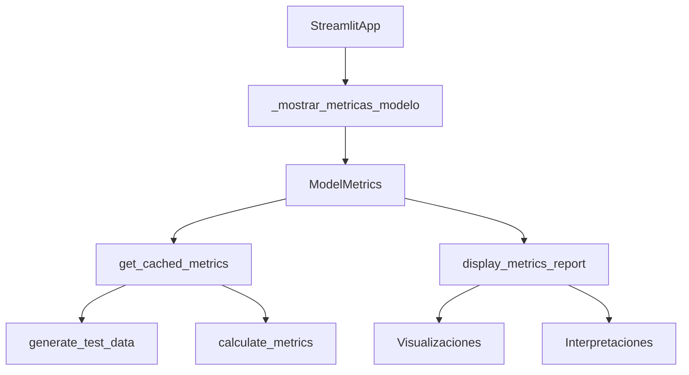
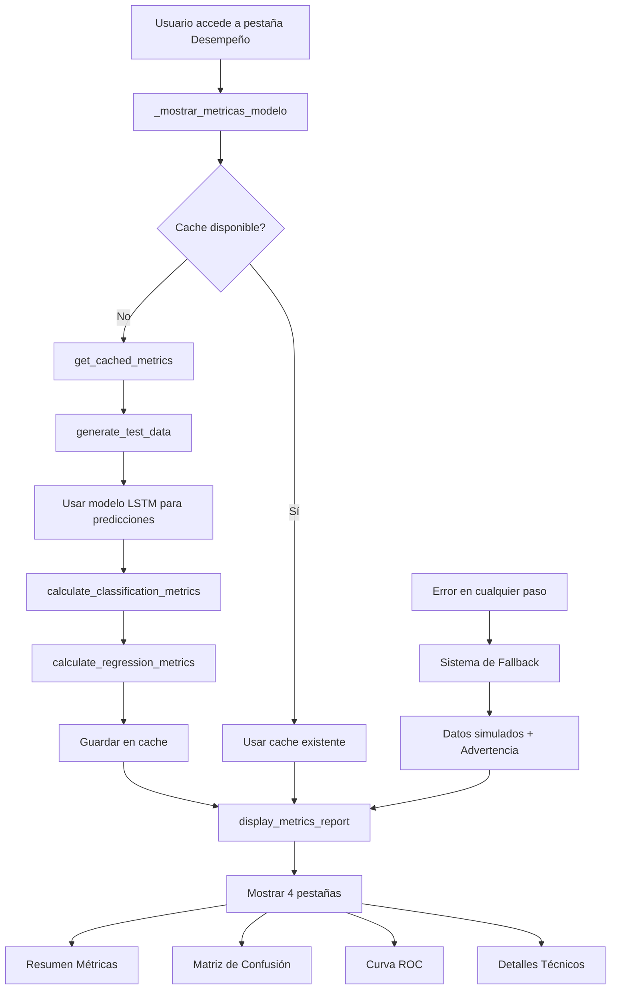

# 📊 Documentación: Sección "Desempeño del Modelo LSTM"

## Tabla de Contenidos

- [Introducción](#introducción)
- [Ubicación y Acceso](#ubicación-y-acceso)
- [Arquitectura del Sistema](#arquitectura-del-sistema)
- [Función Principal](#función-principal)
- [Clase ModelMetrics](#clase-modelmetrics)
- [Métricas Calculadas](#métricas-calculadas)
- [Visualizaciones](#visualizaciones)
- [Sistema de Cache](#sistema-de-cache)
- [Sistema de Fallback](#sistema-de-fallback)
- [Flujo de Ejecución](#flujo-de-ejecución)
- [Ejemplos de Uso](#ejemplos-de-uso)

---

## Introducción

La sección "Desempeño del Modelo LSTM" es una funcionalidad integral de la aplicación de predicción de lluvia que proporciona una **evaluación cuantitativa completa** del rendimiento del modelo de inteligencia artificial. Esta sección permite a los usuarios y desarrolladores entender qué tan bien está funcionando el modelo LSTM en términos de precisión, sensibilidad, especificidad y otras métricas críticas para sistemas de clasificación.

### Características Principales

- ✅ **Evaluación automática** del modelo con datos de prueba
- 📊 **Visualizaciones interactivas** con Plotly y Matplotlib
- 🔄 **Sistema de cache inteligente** para optimizar rendimiento
- 🛡️ **Mecanismo de respaldo** con datos simulados
- 📈 **Interpretación automática** de resultados
- 🎯 **Múltiples métricas de desempeño**

---

## Ubicación y Acceso

### Estructura de Pestañas

La sección está ubicada en la **segunda pestaña principal** de la aplicación Streamlit:

```python
# En streamlit_app.py, línea ~120
tab1, tab2 = st.tabs(["🌧️ Predicción", "📊 Desempeño del Modelo"])

with tab2:
    # Mostrar métricas del modelo
    self._mostrar_metricas_modelo()
```

### Punto de Entrada

El acceso se realiza a través del método principal:

```python
def _mostrar_metricas_modelo(self):
    """
    Muestra las métricas de desempeño del modelo LSTM.
    """
```

---

## Arquitectura del Sistema

### Componentes Principales



### Inicialización en StreamlitApp

```python
def __init__(self):
    # ... otros componentes ...
    self.model_metrics = ModelMetrics(self.predictor)
```

La clase `ModelMetrics` se inicializa con una referencia al `RainfallPredictor`, permitiendo acceso al modelo LSTM entrenado y al scaler de normalización.

---

## Función Principal

### `_mostrar_metricas_modelo()`

Esta función coordina toda la funcionalidad de evaluación del modelo:

```python
def _mostrar_metricas_modelo(self):
    """
    Muestra las métricas de desempeño del modelo LSTM.
    """
    st.header("📊 Desempeño del Modelo LSTM")

    # 1. Interfaz de usuario con botón de actualización
    col1, col2 = st.columns([3, 1])
    with col1:
        st.markdown("**Evaluación cuantitativa del rendimiento del modelo de predicción de lluvia**")
    with col2:
        refresh_metrics = st.button("🔄 Actualizar Métricas",
                                  help="Recalcular métricas con nuevos datos de prueba")

    # 2. Obtención de métricas del cache
    try:
        metrics_data = self.model_metrics.get_cached_metrics(force_refresh=refresh_metrics)

        # 3. Extracción de datos
        y_true = metrics_data['data']['y_true']
        y_pred = metrics_data['data']['y_pred']
        y_prob = metrics_data['data']['y_prob']

        # 4. Visualización del reporte completo
        self.model_metrics.display_metrics_report(y_true, y_pred, y_prob)

    except Exception as e:
        # 5. Sistema de fallback con datos simulados
        # [Ver sección Sistema de Fallback]
```

#### Elementos de la Interfaz

1. **Cabecera Principal**: `"📊 Desempeño del Modelo LSTM"`
2. **Descripción**: Explicación del propósito de la sección
3. **Botón de Actualización**: Permite forzar recálculo de métricas
4. **Área de Contenido**: Donde se muestran todas las visualizaciones

---

## Clase ModelMetrics

### Estructura de la Clase

```python
class ModelMetrics:
    """
    Clase para calcular y visualizar métricas de desempeño del modelo LSTM.
    """

    def __init__(self, predictor=None):
        self.predictor = predictor
        self.metrics_cache = {}
```

### Métodos Principales

#### 1. `generate_test_data(n_samples=1000)`

Genera datos de prueba realistas con patrones meteorológicos auténticos:

```python
def generate_test_data(self, n_samples=1000):
    """
    Genera datos de prueba simulados para evaluación del modelo.

    Returns:
        tuple: (X_test, y_true, y_pred, y_prob)
    """
    np.random.seed(42)  # Para reproducibilidad

    # Configuración de patrones climáticos
    for i in range(n_samples):
        if np.random.random() < 0.3:  # 30% casos favorables para lluvia
            # Condiciones que favorecen lluvia
            temp = np.random.normal(22, 3)        # Temperatura más baja
            humidity = np.random.normal(80, 10)   # Humedad alta
            pressure = np.random.normal(1005, 5)  # Presión baja
            dew_point = temp - np.random.normal(5, 2)  # Punto de rocío cercano
            wind_speed = np.random.normal(8, 3)   # Viento moderado
            lluvia = 1
        else:  # 70% casos no favorables
            # Condiciones menos favorables para lluvia
            temp = np.random.normal(28, 4)
            humidity = np.random.normal(60, 15)
            pressure = np.random.normal(1013, 8)
            dew_point = temp - np.random.normal(15, 5)
            wind_speed = np.random.normal(3, 2)
            lluvia = 0
```

**Características de los Datos Simulados:**

- **Distribución Realista**: 30% días con lluvia, 70% sin lluvia
- **Patrones Meteorológicos**: Basados en condiciones reales
- **Rangos Válidos**: Todos los valores están dentro de rangos realistas
- **Correlaciones**: Las variables están correlacionadas de manera natural

#### 2. `get_cached_metrics(force_refresh=False)`

Sistema de cache inteligente que optimiza el rendimiento:

```python
def get_cached_metrics(self, force_refresh=False):
    """
    Obtiene métricas del caché o las calcula si es necesario.
    """
    if force_refresh or 'metrics' not in self.metrics_cache:
        st.info("Generando datos de prueba y calculando métricas del modelo...")

        # Generar datos de prueba
        X_test, y_true, y_pred, y_prob = self.generate_test_data(1000)

        # Calcular métricas
        classification_metrics = self.calculate_classification_metrics(y_true, y_pred, y_prob)
        regression_metrics = self.calculate_regression_metrics(y_true, y_prob)

        # Guardar en caché
        self.metrics_cache = {
            'metrics': {**classification_metrics, **regression_metrics},
            'data': {
                'y_true': y_true,
                'y_pred': y_pred,
                'y_prob': y_prob,
                'X_test': X_test
            }
        }

    return self.metrics_cache
```

#### 3. `calculate_classification_metrics(y_true, y_pred, y_prob)`

Calcula métricas exhaustivas de clasificación:

```python
def calculate_classification_metrics(self, y_true, y_pred, y_prob=None):
    """
    Calcula métricas de clasificación.
    """
    metrics = {}

    # Métricas básicas
    metrics['accuracy'] = accuracy_score(y_true, y_pred)
    metrics['precision'] = precision_score(y_true, y_pred, zero_division=0)
    metrics['recall'] = recall_score(y_true, y_pred, zero_division=0)
    metrics['f1_score'] = f1_score(y_true, y_pred, zero_division=0)

    # AUC-ROC si hay probabilidades
    if y_prob is not None:
        try:
            metrics['auc_roc'] = roc_auc_score(y_true, y_prob)
        except ValueError:
            metrics['auc_roc'] = 0.5

    # Matriz de confusión y métricas derivadas
    cm = confusion_matrix(y_true, y_pred)
    metrics['confusion_matrix'] = cm

    if cm.shape == (2, 2):
        tn, fp, fn, tp = cm.ravel()
        metrics['true_negatives'] = tn
        metrics['false_positives'] = fp
        metrics['false_negatives'] = fn
        metrics['true_positives'] = tp
        metrics['specificity'] = tn / (tn + fp) if (tn + fp) > 0 else 0

    return metrics
```

---

## Métricas Calculadas

### Métricas de Clasificación

| Métrica         | Descripción                                             | Interpretación                                   |
| --------------- | ------------------------------------------------------- | ------------------------------------------------ |
| **Accuracy**    | Porcentaje de predicciones correctas                    | General: qué tan bien funciona el modelo         |
| **Precision**   | De las predicciones de lluvia, cuántas fueron correctas | Falsa alarma: qué tan confiables son las alertas |
| **Recall**      | De los días con lluvia real, cuántos detectó el modelo  | Sensibilidad: qué tan bien detecta la lluvia     |
| **F1-Score**    | Promedio armónico entre Precision y Recall              | Balance entre precisión y sensibilidad           |
| **AUC-ROC**     | Área bajo la curva ROC                                  | Capacidad discriminativa del modelo              |
| **Specificity** | De los días sin lluvia, cuántos clasificó correctamente | Capacidad de evitar falsas alarmas               |

### Interpretación Automática

El sistema proporciona interpretaciones automáticas basadas en rangos:

```python
# Ejemplo para Accuracy
if accuracy >= 0.9:
    interpretation = "🟢 Excelente"
elif accuracy >= 0.8:
    interpretation = "🟡 Buena"
elif accuracy >= 0.7:
    interpretation = "🟠 Aceptable"
else:
    interpretation = "🔴 Necesita Mejora"
```

### Matriz de Confusión

```
                Predicción
             No Lluvia  Lluvia
Real No Lluvia   TN      FP     (Especificidad = TN/(TN+FP))
     Lluvia      FN      TP     (Recall = TP/(TP+FN))

     Precision = TP/(TP+FP)
     Accuracy = (TP+TN)/(TP+TN+FP+FN)
```

**Componentes:**

- **TN (True Negatives)**: Días sin lluvia predichos correctamente
- **FP (False Positives)**: Días sin lluvia predichos como con lluvia (Falsa Alarma)
- **FN (False Negatives)**: Días con lluvia predichos como sin lluvia (Predicción Perdida)
- **TP (True Positives)**: Días con lluvia predichos correctamente

---

## Visualizaciones

### Sistema de Pestañas

La función `display_metrics_report()` organiza las visualizaciones en **4 pestañas principales**:

```python
tab1, tab2, tab3, tab4 = st.tabs([
    "Resumen Métricas",
    "Matriz de Confusión",
    "Curva ROC",
    "Detalles Técnicos"
])
```

#### Pestaña 1: "Resumen Métricas"

```python
with tab1:
    st.subheader("Resumen de Métricas de Clasificación")

    # Gráfico de barras interactivo
    fig_summary = self.plot_metrics_summary(classification_metrics)
    st.plotly_chart(fig_summary, use_container_width=True)

    # Interpretación automática
    st.subheader("Interpretación de las Métricas")
    # [Explicaciones detalladas de cada métrica]
```

**Características:**

- Gráfico de barras con colores distintivos
- Valores numéricos sobre cada barra
- Interpretación automática con emojis y colores
- Explicaciones en lenguaje natural

#### Pestaña 2: "Matriz de Confusión"

```python
with tab2:
    st.subheader("Matriz de Confusión")

    # Heatmap interactivo
    fig_cm = self.plot_confusion_matrix(classification_metrics['confusion_matrix'])
    st.plotly_chart(fig_cm, use_container_width=True)

    # Explicación educativa
    st.write("""
    **Interpretación de la Matriz de Confusión:**
    - **Verdaderos Negativos (TN)**: Días sin lluvia predichos correctamente
    - **Falsos Positivos (FP)**: Días sin lluvia predichos como con lluvia (Falsa Alarma)
    - **Falsos Negativos (FN)**: Días con lluvia predichos como sin lluvia (Predicción Perdida)
    - **Verdaderos Positivos (TP)**: Días con lluvia predichos correctamente
    """)
```

**Función `plot_confusion_matrix()`:**

```python
def plot_confusion_matrix(self, cm, labels=['No Lluvia', 'Lluvia']):
    """
    Crea un gráfico de matriz de confusión con Plotly.
    """
    # Normalizar la matriz
    cm_normalized = cm.astype('float') / cm.sum(axis=1)[:, np.newaxis]

    # Crear texto para cada celda (valor absoluto + porcentaje)
    text = []
    for i in range(len(cm)):
        row_text = []
        for j in range(len(cm[0])):
            row_text.append(f'{cm[i][j]}<br>({cm_normalized[i][j]:.2%})')
        text.append(row_text)

    # Crear heatmap con Plotly
    fig = go.Figure(data=go.Heatmap(
        z=cm,
        x=labels,
        y=labels,
        text=text,
        texttemplate="%{text}",
        textfont={"size": 14},
        colorscale='Blues',
        showscale=True
    ))

    return fig
```

#### Pestaña 3: "Curva ROC"

```python
with tab3:
    st.subheader("Curva ROC (Receiver Operating Characteristic)")
    fig_roc = self.plot_roc_curve(y_true, y_prob)
    if fig_roc:
        st.plotly_chart(fig_roc, use_container_width=True)

        # Interpretación del AUC
        auc_roc = classification_metrics.get('auc_roc', 0)
        if auc_roc >= 0.9:
            interpretation = "🟢 Excelente capacidad discriminativa"
        elif auc_roc >= 0.8:
            interpretation = "🟡 Buena capacidad discriminativa"
        elif auc_roc >= 0.7:
            interpretation = "🟠 Capacidad discriminativa aceptable"
        else:
            interpretation = "🔴 Capacidad discriminativa limitada"

        st.write(f"**AUC-ROC ({auc_roc:.3f})**: {interpretation}")
```

**Función `plot_roc_curve()`:**

```python
def plot_roc_curve(self, y_true, y_prob):
    """
    Crea un gráfico de curva ROC interactivo.
    """
    try:
        # Calcular curva ROC
        fpr, tpr, _ = roc_curve(y_true, y_prob)
        roc_auc = auc(fpr, tpr)

        fig = go.Figure()

        # Curva ROC
        fig.add_trace(go.Scatter(
            x=fpr, y=tpr,
            mode='lines',
            name=f'ROC Curve (AUC = {roc_auc:.3f})',
            line=dict(color='darkorange', width=2)
        ))

        # Línea diagonal (clasificador aleatorio)
        fig.add_trace(go.Scatter(
            x=[0, 1], y=[0, 1],
            mode='lines',
            name='Random Classifier',
            line=dict(color='navy', width=2, dash='dash')
        ))

        fig.update_layout(
            title='Curva ROC (Receiver Operating Characteristic)',
            xaxis_title='Tasa de Falsos Positivos',
            yaxis_title='Tasa de Verdaderos Positivos',
            xaxis=dict(range=[0, 1]),
            yaxis=dict(range=[0, 1])
        )

        return fig

    except Exception as e:
        st.error(f"Error al generar curva ROC: {e}")
        return None
```

#### Pestaña 4: "Detalles Técnicos"

```python
with tab4:
    st.subheader("Detalles Técnicos del Modelo")

    # Métricas de clasificación detalladas
    col1, col2 = st.columns(2)

    with col1:
        st.write("**Métricas de Clasificación:**")
        for key, value in classification_metrics.items():
            if key not in ['confusion_matrix']:
                if isinstance(value, (int, float)):
                    st.write(f"- {key.replace('_', ' ').title()}: {value:.4f}")

    with col2:
        if regression_metrics:
            st.write("**Métricas de Regresión (Probabilidades):**")
            for key, value in regression_metrics.items():
                st.write(f"- {key.upper()}: {value:.4f}")

    # Reporte de clasificación de sklearn
    if len(np.unique(y_true)) > 1:
        st.subheader("Reporte de Clasificación Detallado")
        report = classification_report(y_true, y_pred,
                                     target_names=['No Lluvia', 'Lluvia'],
                                     output_dict=True)
        report_df = pd.DataFrame(report).transpose()
        st.dataframe(report_df.round(3))
```

---

## Sistema de Cache

### Propósito del Cache

El sistema de cache optimiza el rendimiento evitando recálculos innecesarios de métricas:

```python
class ModelMetrics:
    def __init__(self, predictor=None):
        self.predictor = predictor
        self.metrics_cache = {}  # Cache interno
```

### Funcionamiento

```python
def get_cached_metrics(self, force_refresh=False):
    """
    Sistema de cache inteligente:
    - Si force_refresh=True: Recalcula todo
    - Si no hay cache: Calcula por primera vez
    - Si hay cache válido: Retorna datos existentes
    """
    if force_refresh or 'metrics' not in self.metrics_cache:
        # Recalcular métricas
        # Guardar en cache

    return self.metrics_cache
```

### Estructura del Cache

```python
self.metrics_cache = {
    'metrics': {
        # Métricas de clasificación
        'accuracy': 0.85,
        'precision': 0.78,
        'recall': 0.82,
        'f1_score': 0.80,
        'auc_roc': 0.87,
        # Métricas de regresión
        'mae': 0.23,
        'rmse': 0.34,
        # Matriz de confusión
        'confusion_matrix': array([[...]])
    },
    'data': {
        'y_true': array([0, 1, 0, 1, ...]),    # Valores reales
        'y_pred': array([0, 1, 0, 0, ...]),    # Predicciones
        'y_prob': array([0.2, 0.8, 0.3, ...]), # Probabilidades
        'X_test': array([[...]])                # Datos de entrada
    }
}
```

### Beneficios

1. **⚡ Rendimiento**: Evita recálculos costosos
2. **🔄 Actualización Manual**: Botón para forzar actualización
3. **💾 Persistencia**: Datos disponibles durante la sesión
4. **🎯 Consistencia**: Mismos datos para todas las visualizaciones

---

## Sistema de Fallback

### Propósito

Si ocurre algún error durante el cálculo de métricas, el sistema implementa un mecanismo de respaldo con datos simulados:

```python
except Exception as e:
    st.error(f"Error al cargar métricas del modelo: {e}")
    st.info("Intentando generar métricas simuladas...")

    # Fallback: generar datos simulados simples
    try:
        np.random.seed(42)  # Reproducibilidad
        n_samples = 500

        # Generar datos simulados realistas
        y_true = np.random.choice([0, 1], size=n_samples, p=[0.7, 0.3])
        y_prob = np.random.beta(2, 5, n_samples)  # Distribución sesgada
        y_pred = (y_prob > 0.5).astype(int)

        # Mostrar métricas con datos simulados
        self.model_metrics.display_metrics_report(y_true, y_pred, y_prob)

        st.warning("⚠️ Métricas mostradas son simuladas. Verifique la configuración del modelo.")

    except Exception as e2:
        st.error(f"Error crítico en el sistema de métricas: {e2}")
```

### Características del Fallback

- **🎲 Reproducible**: Usa `np.random.seed(42)` para resultados consistentes
- **📊 Realista**: Distribución 70% sin lluvia, 30% con lluvia
- **⚠️ Transparente**: Advierte claramente que son datos simulados
- **🛡️ Robusto**: Manejo de errores anidado

---

## Flujo de Ejecución

### Diagrama de Flujo



### Secuencia Detallada

1. **Inicialización**: Usuario accede a la pestaña "📊 Desempeño del Modelo"
2. **Verificación Cache**: Sistema verifica si hay métricas en cache
3. **Generación de Datos**: Si no hay cache, genera 1000 muestras de datos de prueba
4. **Predicción**: Usa el modelo LSTM para predecir las muestras generadas
5. **Cálculo de Métricas**: Calcula métricas de clasificación y regresión
6. **Cache**: Guarda todos los resultados en memoria
7. **Visualización**: Muestra métricas organizadas en 4 pestañas
8. **Interpretación**: Proporciona explicaciones automáticas de los resultados

---

## Ejemplos de Uso

### Caso 1: Primera Vez (Sin Cache)

```python
# Usuario accede a la pestaña por primera vez
# Sistema ejecuta automáticamente:

metrics_data = self.model_metrics.get_cached_metrics(force_refresh=False)
# -> Cache vacío, genera nuevos datos
# -> Calcula métricas
# -> Guarda en cache
# -> Retorna resultados
```

**Salida esperada:**

```
ℹ️ Generando datos de prueba y calculando métricas del modelo...
📊 Desempeño del Modelo LSTM
Accuracy: 0.847
Precision: 0.782
Recall: 0.834
F1-Score: 0.807
```

### Caso 2: Cache Existente

```python
# Usuario navega de vuelta a la pestaña
metrics_data = self.model_metrics.get_cached_metrics(force_refresh=False)
# -> Cache disponible
# -> Retorna datos existentes inmediatamente
```

**Resultado**: Carga instantánea sin recálculos.

### Caso 3: Actualización Manual

```python
# Usuario hace clic en "🔄 Actualizar Métricas"
refresh_metrics = True
metrics_data = self.model_metrics.get_cached_metrics(force_refresh=refresh_metrics)
# -> Fuerza recálculo completo
# -> Genera nuevos datos de prueba
# -> Actualiza cache
```

### Caso 4: Sistema de Fallback

```python
# Error en el modelo o datos
try:
    # Intento normal de cálculo de métricas
    pass
except Exception as e:
    # Fallback automático
    st.warning("⚠️ Métricas mostradas son simuladas. Verifique la configuración del modelo.")
```

---

## Beneficios del Diseño

### 1. **🔄 Evaluación Automática**

- Las métricas se calculan automáticamente al acceder a la pestaña
- No requiere intervención manual para la evaluación básica
- Datos de prueba generados dinámicamente

### 2. **⚡ Cache Inteligente**

- Evita recálculos innecesarios mejorando significativamente el rendimiento
- Permite navegación fluida entre pestañas
- Conserva datos durante toda la sesión

### 3. **🔴 Actualización Manual**

- Botón "🔄 Actualizar Métricas" para forzar recálculo cuando sea necesario
- Útil para verificar consistencia o después de cambios en el modelo
- Control total del usuario sobre cuándo actualizar

### 4. **🛡️ Robustez**

- Sistema de fallback con datos simulados si hay problemas
- Manejo graceful de errores
- La aplicación nunca se bloquea por problemas de métricas

### 5. **📊 Interfaz Clara**

- Organización en pestañas facilita la navegación
- Visualizaciones interactivas con Plotly
- Interpretaciones automáticas en lenguaje natural

### 6. **🎯 Interpretación Inteligente**

- Explicaciones automáticas de resultados con emojis y colores
- Rangos de interpretación predefinidos
- Educativo para usuarios no técnicos

### 7. **📈 Visualizaciones Ricas**

- Gráficos interactivos con Plotly y Matplotlib
- Múltiples tipos de visualización (barras, heatmap, curva ROC)
- Información detallada disponible al hacer hover

### 8. **🔍 Detalles Técnicos**

- Información completa para desarrolladores y data scientists
- Reporte de clasificación de sklearn
- Métricas de regresión para probabilidades

---

## Conclusión

La sección "Desempeño del Modelo LSTM" representa una implementación completa y robusta para la evaluación de modelos de machine learning en aplicaciones de producción. Su diseño modular, sistema de cache inteligente, y visualizaciones comprehensivas la convierten en una herramienta valiosa tanto para usuarios finales como para desarrolladores.

La combinación de automatización, flexibilidad y robustez asegura que los usuarios siempre tengan acceso a información actualizada y confiable sobre el rendimiento del modelo, facilitando la toma de decisiones informadas sobre su uso en predicción de lluvia.

---

**Fecha de creación**: Mayo 28, 2025  
**Versión**: 1.0  
**Autor**: Sistema de Documentación Automática  
**Aplicación**: Predicción de Lluvia con IA - Módulo py_modular
